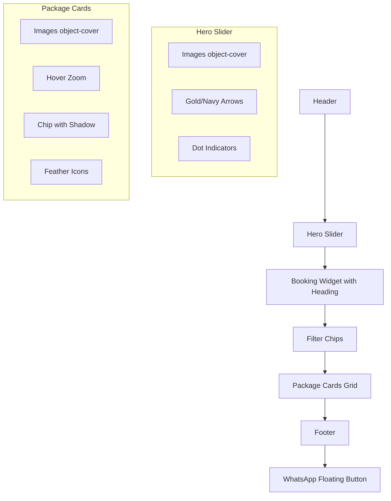

# Index Page UI Implementation Plan

Based on [`plans/ux-ui-improvements-index.md`](plans/ux-ui-improvements-index.md)

> **Note:** Section order remains as-is: Header → Booking Widget → Hero Slider → Packages → Footer

---

## Files to Modify

1. **`views/index.ejs`** — Hero changes, card changes, widget heading, chip classes, emoji replacement
2. **`views/partials/header.ejs`** — Logo size, hide Hoteles button
3. **`views/partials/footer.ejs`** — Add logo icon to left section
4. **`public/styles/theme.css`** — New chip styles, hero dot indicators, card hover effects, tooltip styles
5. **`public/js/main.js`** — Hero slider dot indicator logic, tooltip behavior

---

## 2. Hero Slider Changes (`views/index.ejs` + `theme.css` + `main.js`)

### 2a. Image fit change
- Change `object-contain` → `object-cover` on line 50

### 2b. Arrow color change
- Change from `bg-white/20 text-white` → `bg-brand/60 text-accent hover:bg-accent hover:text-brand`

### 2c. Dot indicators
Add after the slider arrows (inside the `relative max-w-5xl` div):
```html
<!-- Slide indicators -->
<div class="absolute bottom-4 left-1/2 -translate-x-1/2 flex gap-2" id="slideIndicators">
  <% if (heroImages && heroImages.length) { %>
    <% heroImages.forEach((_, i) => { %>
      <button class="w-2.5 h-2.5 rounded-full transition-all duration-300 <%= i === 0 ? 'bg-accent w-6' : 'bg-white/50' %>" data-slide="<%= i %>"></button>
    <% }) %>
  <% } %>
</div>
```

### 2d. JS for dot indicators (in `main.js`)
- Update existing slider logic to also update dot indicator active state
- Active dot: `bg-accent w-6`, inactive: `bg-white/50 w-2.5`
- Add click handlers on dots to jump to specific slides

---

## 3. Booking Widget Heading (`views/index.ejs`)

Wrap the widget section with a heading:
```html
<!-- Tatajuba travel widget -->
<section class="px-4 md:px-[10%] py-8 mb-16">
  <div class="text-center mb-6">
    <h2 class="text-2xl sm:text-3xl font-bold font-serif">Busca tu destino</h2>
    <div class="divider mx-auto"></div>
  </div>
  <div class="max-w-4xl mx-auto">
    <!-- iframe here -->
  </div>
</section>
```

---

## 4. Package Card Changes (`views/index.ejs` + `theme.css`)

### 4a. Image fit
- Change `object-contain` → `object-cover` on line 102

### 4b. Image hover zoom
Wrap the image in a container with overflow hidden:
```html
<div class="overflow-hidden rounded-xl mb-4">
  
</div>
```

### 4c. Chip badge shadow
Add `shadow-md` and a subtle background:
```html
<span class="btn-accent chip text-sm absolute top-2 left-2 shadow-md bg-accent/90 backdrop-blur-sm"> <%= pkg.continent %> </span>
```

### 4d. Replace emojis with Feather icons
- Replace `📅` with `<i data-feather="calendar" class="w-4 h-4 inline"></i>`
- Replace `💶` with `<i data-feather="ticket" class="w-4 h-4 inline"></i>` (or keep text-only for price)

---

## 5. Filter Chips Redesign (`views/index.ejs` + `theme.css`)

### New chip styles in `theme.css`:
```css
/* Filter chip styles */
.chip {
  background: transparent;
  color: var(--accent);
  border: 1.5px solid var(--accent);
  padding: 6px 16px;
  border-radius: 999px;
  font-weight: 600;
  font-size: 0.875rem;
  transition: all 0.2s ease;
  cursor: pointer;
}

.chip:hover {
  background: rgba(212, 175, 55, 0.1);
  transform: scale(1.03);
}

.chip.active {
  background: var(--accent);
  color: var(--brand);
  border-color: var(--accent);
}
```

### Update HTML in `index.ejs`:
Remove `btn-accent` class from chips, use just `chip`:
```html
<button class="chip active" data-continent="all">Todos</button>
```

---

## 6. Header Changes (`views/partials/header.ejs`)

### 6a. Logo size
- Change `h-10 w-10` → `h-12 w-12`

### 6b. Hide "Hoteles" button
- Add `hidden` class or comment out the Hoteles link:
```html
<!-- <a href="/hoteles" class="btn-accent ...">Hoteles</a> -->
```

---

## 7. Footer Changes (`views/partials/footer.ejs`)

Add logo icon to the left section:
```html
<div>
  
  <p class="text-sm text-gray-400">Viajes deportivos exclusivos</p>
</div>
```

---

## 8. WhatsApp Tooltip (`views/index.ejs` + `theme.css`)

Add a tooltip element before the WhatsApp button:
```html
<!-- WhatsApp tooltip -->
<div class="whatsapp-tooltip hidden sm:block">
  <span>¿Necesitas ayuda?</span>
</div>
<a href="https://wa.me/..." class="whatsapp-btn ...">
  <i data-feather="message-circle" class="w-6 h-6"></i>
</a>
```

### CSS for tooltip:
```css
.whatsapp-tooltip {
  position: fixed;
  bottom: 22px;
  right: 72px;
  background: white;
  color: #333;
  padding: 6px 12px;
  border-radius: 8px;
  font-size: 0.8rem;
  box-shadow: 0 4px 12px rgba(0,0,0,0.15);
  z-index: 50;
  opacity: 0;
  transition: opacity 0.2s ease;
  pointer-events: none;
}

.whatsapp-btn:hover + .whatsapp-tooltip,
.whatsapp-tooltip:hover {
  opacity: 1;
}
```

---

## 9. Consistent Spacing

- Hero slider: `mb-12` (was `mb-16`)
- Widget section: `mb-16` (add bottom margin)
- Packages section: `mb-16` (keep as is)

---

## Implementation Order

1. **`views/index.ejs`** — Reorder sections, hero changes, card changes, widget heading, chip classes, emoji replacement
2. **`views/partials/header.ejs`** — Logo size, hide Hoteles
3. **`views/partials/footer.ejs`** — Add logo
4. **`public/styles/theme.css`** — Chip styles, tooltip styles
5. **`public/js/main.js`** — Slider dot indicator logic, tooltip behavior

---

## Mermaid Diagram: Component Flow


