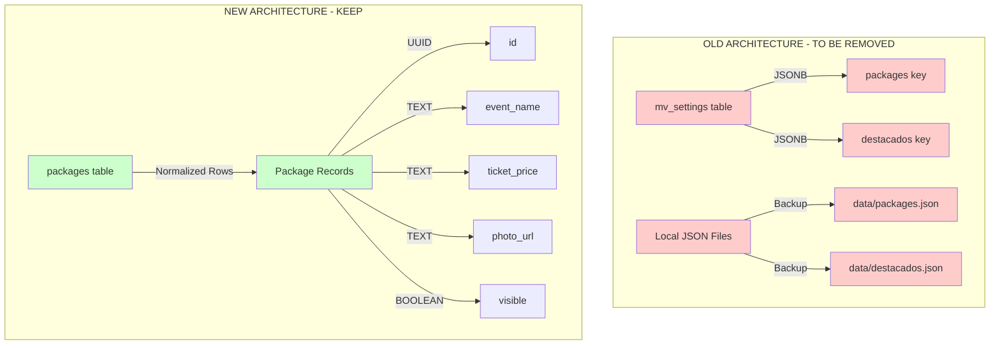
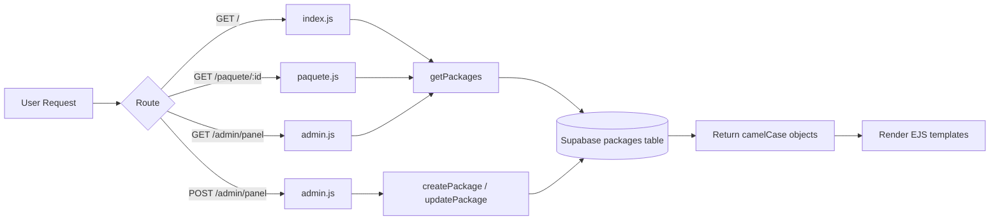

# JSON Storage Cleanup Plan

## Executive Summary

Remove all legacy JSON file storage code and destacados functionality. The application already uses the `packages` table in Supabase correctly - this is purely a code cleanup task to remove unused legacy code.

**Important**: No data migration needed. The packages table already contains all current data.

## Current State Analysis

### What's Currently Implemented

#### ✅ Already Using Supabase
- **Packages Table**: Dedicated `packages` table with proper schema (UUID, snake_case fields)
- **CRUD Operations**: Full CRUD operations for packages in [`supabaseStorage.js`](../src/services/supabaseStorage.js)
- **Field Mapping**: Proper camelCase ↔ snake_case conversion for templates
- **Routes**: All main routes ([`admin.js`](../src/routes/admin.js), [`index.js`](../src/routes/index.js), [`paquete.js`](../src/routes/paquete.js)) use Supabase functions

#### ❌ Legacy JSON Code to Remove
1. **File System Operations** in [`supabaseStorage.js`](../src/services/supabaseStorage.js:8-56):
   - `fs` module import (line 8)
   - `path` module import (line 9)
   - `localDataDir` creation (lines 30-33)
   - `loadJSONFile()` function (lines 38-50)
   - `saveJSONFile()` function (lines 52-60)
   - Local file paths: `localPackagesPath`, `localDestacadosPath`

2. **Destacados/Events Functionality**:
   - `loadDestacadosJSON()` in [`supabaseStorage.js`](../src/services/supabaseStorage.js:102-110)
   - `getDestacados()` in [`supabaseStorage.js`](../src/services/supabaseStorage.js:113-115)
   - `saveDestacadosJSON()` in [`supabaseStorage.js`](../src/services/supabaseStorage.js:118-126)
   - Destacados handling in [`admin.js`](../src/routes/admin.js:62-63,122-124)
   - Events loading in [`index.js`](../src/routes/index.js:20)
   - Events display in [`index.ejs`](../views/index.ejs) (not found in current view)

3. **Old mv_settings Table**:
   - Defined in [`supabase_schema.sql`](../supabase_schema.sql:13-30)
   - Stores packages and destacados as JSONB
   - No longer needed with dedicated packages table

4. **Temp Directory**:
   - Contains old JSON-based implementation
   - Should be removed entirely

5. **Empty data/ Directory**:
   - Previously held JSON files
   - Now empty, can be removed

## Migration Architecture

### Database Schema



### Current Packages Table Schema

```sql
CREATE TABLE packages (
  id UUID PRIMARY KEY DEFAULT uuid_generate_v4(),
  event_name TEXT NOT NULL,
  ticket_price TEXT,
  flight_info TEXT,
  hotel_info TEXT,
  description TEXT,
  availability_dates TEXT,
  photo_url TEXT,
  visible BOOLEAN DEFAULT true
);
```

**Note**: This schema is already correct and matches application needs.

## Detailed Migration Steps

### Phase 1: Code Cleanup

#### 1.1 Update [`src/services/supabaseStorage.js`](../src/services/supabaseStorage.js)

**Remove:**
- Lines 8-9: `fs` and `path` imports
- Lines 30-37: Local directory and file path setup
- Lines 38-60: `loadJSONFile()` and `saveJSONFile()` functions
- Lines 99-126: All destacados functions (`loadDestacadosJSON`, `getDestacados`, `saveDestacadosJSON`)
- Module exports: Remove `loadDestacadosJSON`, `getDestacados`, `saveDestacadosJSON`

**Keep:**
- Supabase client initialization
- Field mapping functions (`dbRowToPackage`, `packageToDbRow`)
- Package CRUD functions (`getPackages`, `createPackage`, `updatePackage`, `deletePackage`)

**Result**: Clean service with only packages table operations.

#### 1.2 Update [`src/routes/admin.js`](../src/routes/admin.js)

**Remove:**
- Line 15: `saveDestacadosJSON` from imports
- Lines 62-63: `loadDestacadosJSON` import and call in GET `/panel`
- Line 64: Remove `destacados` from render context
- Lines 122-124: Remove destacados saving in POST `/panel`

**Update:**
- Line 64: Change to `res.render('admin/panel', { paquetes, user: req.session.user });`

#### 1.3 Update [`src/routes/index.js`](../src/routes/index.js)

**Remove:**
- Line 6: `getDestacados` from imports
- Line 20: `const events = await getDestacados();`
- Line 45: Remove `events` from render context

**Update:**
- Line 43-48: Change to `res.render("index", { packages, heroImages, currentPage: "home" });`

#### 1.4 Update [`views/admin/panel.ejs`](../views/admin/panel.ejs)

**No changes needed** - This view already only handles packages, no destacados UI found.

#### 1.5 Update [`views/index.ejs`](../views/index.ejs)

**No changes needed** - This view already only displays packages, no events/destacados display found.

### Phase 2: Schema & Documentation Updates

#### 2.1 Update [`supabase_schema.sql`](../supabase_schema.sql)

**Replace entire file with:**

```sql
-- =====================================================================
-- SUPABASE / POSTGRESQL SCHEMA FOR MANUVIAJES
-- =====================================================================
-- Execute these commands in the "SQL Editor" of your Supabase panel.

-- Enable UUID extension
CREATE EXTENSION IF NOT EXISTS "uuid-ossp";

-- ---------------------------------------------------------------------
-- PACKAGES TABLE - Main storage for travel packages
-- ---------------------------------------------------------------------
CREATE TABLE IF NOT EXISTS packages (
  id UUID PRIMARY KEY DEFAULT uuid_generate_v4(),
  event_name TEXT NOT NULL,
  ticket_price TEXT,
  flight_info TEXT,
  hotel_info TEXT,
  description TEXT,
  availability_dates TEXT,
  photo_url TEXT,
  visible BOOLEAN DEFAULT true,
  created_at TIMESTAMP WITH TIME ZONE DEFAULT timezone('utc'::text, now()),
  updated_at TIMESTAMP WITH TIME ZONE DEFAULT timezone('utc'::text, now())
);

-- Enable Row Level Security (RLS)
ALTER TABLE packages ENABLE ROW LEVEL SECURITY;

-- Create access policies:
-- 1. Allow public read access for visible packages
CREATE POLICY "Allow public read for visible packages" ON packages
    FOR SELECT USING (visible = true);

-- 2. Allow full control for service_role (admin operations)
CREATE POLICY "Allow full control for service role" ON packages
    FOR ALL USING (true);

-- Create index for better query performance
CREATE INDEX IF NOT EXISTS idx_packages_visible ON packages(visible);
CREATE INDEX IF NOT EXISTS idx_packages_created_at ON packages(created_at DESC);

-- ---------------------------------------------------------------------
-- SAMPLE DATA (OPTIONAL)
-- Execute this if you want to populate your database with initial packages
-- ---------------------------------------------------------------------

INSERT INTO packages (event_name, ticket_price, flight_info, hotel_info, description, availability_dates, photo_url, visible) VALUES 
(
  'Paquete Gran Premio de Mónaco 2026',
  '1450',
  'Vuelo ida y vuelta Buenos Aires / Niza con escalas',
  'Estadía de 4 noches en Hotel Best Western Laffayette Monaco',
  'El paquete más espectacular del año para disfrutar de la carrera más legendaria de la F1 en vivo en el circuito callejero de Mónaco.',
  'Del 21 al 25 de mayo 2026',
  '/images/f1.jpeg',
  true
),
(
  'Paquete El Clásico - Real Madrid vs Barcelona',
  '890',
  'Vuelo directo Madrid ida y vuelta',
  'Hotel Tryp Gran Vía de 3 estrellas, céntrico',
  'Vive la máxima rivalidad del fútbol mundial con entradas garantizadas de Categoría 2 para el Estadio Santiago Bernabéu.',
  'Del 23 al 26 de octubre 2026',
  '/images/futbol.jpeg',
  true
);
```

#### 2.2 Update [`docs/json_data_flow.md`](../docs/json_data_flow.md)

**Replace entire file with:**

```markdown
# Data Storage Architecture

## Overview

ManuViajes uses **Supabase PostgreSQL** as the single source of truth for all application data. All JSON file storage has been deprecated and removed.

## Database Schema

### Packages Table

**Table Name**: `packages`

**Purpose**: Stores all travel package information

**Schema**:
```sql
CREATE TABLE packages (
  id UUID PRIMARY KEY DEFAULT uuid_generate_v4(),
  event_name TEXT NOT NULL,
  ticket_price TEXT,
  flight_info TEXT,
  hotel_info TEXT,
  description TEXT,
  availability_dates TEXT,
  photo_url TEXT,
  visible BOOLEAN DEFAULT true,
  created_at TIMESTAMP WITH TIME ZONE DEFAULT now(),
  updated_at TIMESTAMP WITH TIME ZONE DEFAULT now()
);
```

**Field Mapping**:
- Database uses `snake_case` (PostgreSQL convention)
- Application/Templates use `camelCase` (JavaScript convention)
- Automatic conversion handled by [`supabaseStorage.js`](../src/services/supabaseStorage.js)

| Database Field | Application Field | Type | Description |
|---------------|-------------------|------|-------------|
| `id` | `id` | UUID | Unique identifier |
| `event_name` | `eventName` | String | Package name/title |
| `ticket_price` | `ticketPrice` | String | Price (stored as text for flexibility) |
| `flight_info` | `flightInfo` | String | Flight details |
| `hotel_info` | `hotelInfo` | String | Hotel information |
| `description` | `description` | String | Package description |
| `availability_dates` | `availabilityDates` | String | Available dates |
| `photo_url` | `photoUrl` | String | Image URL (Cloudinary) |
| `visible` | `visible` | Boolean | Display on public site |

## Data Access Layer

### Service: [`src/services/supabaseStorage.js`](../src/services/supabaseStorage.js)

**Exported Functions**:

1. **`getPackages()`** - Retrieve all packages
   - Returns: Array of package objects (camelCase)
   - Used by: Home page, admin panel, package detail page

2. **`createPackage(pkg)`** - Create new package
   - Accepts: Package object (camelCase or snake_case)
   - Returns: Created package object (camelCase)
   - Used by: Admin panel

3. **`updatePackage(id, pkg)`** - Update existing package
   - Accepts: UUID and package object
   - Returns: Updated package object (camelCase)
   - Used by: Admin panel

4. **`deletePackage(id)`** - Delete package
   - Accepts: UUID
   - Returns: Boolean success
   - Used by: Admin panel

## Application Flow



## Security

### Row Level Security (RLS)

**Public Access**:
- Read-only access to packages where `visible = true`
- Enforced at database level

**Admin Access**:
- Full CRUD operations via `service_role` key
- Requires authentication via admin panel

### Environment Variables

Required in `.env`:
```bash
SUPABASE_URL=your_supabase_url
SUPABASE_KEY=your_service_role_key
```

## Migration Notes

### Deprecated Features (Removed)

- ❌ JSON file storage in `/data` directory
- ❌ `mv_settings` table with JSONB storage
- ❌ Destacados/events functionality
- ❌ Local file system operations
- ❌ Backup/sync mechanisms

### Current Architecture (Active)

- ✅ Single `packages` table
- ✅ Normalized relational data
- ✅ UUID primary keys
- ✅ Row Level Security
- ✅ Automatic field mapping
- ✅ Cloudinary for images

## Best Practices

1. **Always use service functions** - Don't query Supabase directly from routes
2. **Field naming** - Use camelCase in JavaScript, snake_case in SQL
3. **Image storage** - Use Cloudinary URLs in `photo_url` field
4. **Visibility control** - Use `visible` boolean for draft/published state
5. **Error handling** - All service functions throw errors that should be caught in routes
```

#### 2.3 Create Migration Guide

**New file**: [`docs/migration-guide.md`](../docs/migration-guide.md)

```markdown
# Migration Guide: mv_settings to packages Table

## Overview

If you have existing data in the `mv_settings` table (old JSONB storage), follow this guide to migrate to the new `packages` table.

## Prerequisites

- Access to Supabase SQL Editor
- Backup of existing data (recommended)

## Migration Steps

### Step 1: Backup Existing Data

```sql
-- Export current packages from mv_settings
SELECT value FROM mv_settings WHERE key = 'packages';

-- Save the output to a file for backup
```

### Step 2: Check Packages Table Exists

```sql
-- Verify packages table exists
SELECT * FROM packages LIMIT 1;

-- If table doesn't exist, run the schema from supabase_schema.sql
```

### Step 3: Migrate Data

```sql
-- Extract packages from mv_settings and insert into packages table
INSERT INTO packages (event_name, ticket_price, flight_info, hotel_info, description, availability_dates, photo_url, visible)
SELECT 
  pkg->>'eventName' as event_name,
  pkg->>'ticketPrice' as ticket_price,
  pkg->>'flightInfo' as flight_info,
  pkg->>'hotelInfo' as hotel_info,
  pkg->>'description' as description,
  pkg->>'availabilityDates' as availability_dates,
  COALESCE(pkg->>'photoUrl', '/images/' || (pkg->>'foto') || '.jpeg') as photo_url,
  COALESCE((pkg->>'visible')::boolean, true) as visible
FROM mv_settings, jsonb_array_elements(value) as pkg
WHERE key = 'packages';
```

### Step 4: Verify Migration

```sql
-- Check migrated data
SELECT id, event_name, ticket_price, visible FROM packages;

-- Count records
SELECT COUNT(*) FROM packages;
```

### Step 5: Clean Up (Optional)

```sql
-- Once verified, you can drop the old mv_settings table
-- WARNING: This is irreversible!
DROP TABLE IF EXISTS mv_settings;
```

## Rollback Plan

If you need to rollback:

1. Restore from backup
2. Keep both tables temporarily
3. Test thoroughly before dropping mv_settings

## Post-Migration

1. Update application code (follow main migration plan)
2. Test all CRUD operations in admin panel
3. Verify public site displays packages correctly
4. Test package detail pages
5. Monitor logs for any errors

## Troubleshooting

### Issue: Duplicate packages after migration

```sql
-- Remove duplicates, keeping the newest
DELETE FROM packages a USING packages b
WHERE a.id < b.id AND a.event_name = b.event_name;
```

### Issue: Missing photo URLs

```sql
-- Update packages with missing photos to use default
UPDATE packages 
SET photo_url = '/images/default.jpeg'
WHERE photo_url IS NULL OR photo_url = '';
```

### Issue: Price format inconsistent

```sql
-- Check price formats
SELECT DISTINCT ticket_price FROM packages;

-- Standardize if needed (example)
UPDATE packages 
SET ticket_price = REGEXP_REPLACE(ticket_price, '[^0-9]', '', 'g')
WHERE ticket_price ~ '[^0-9]';
```
```

### Phase 3: Cleanup

#### 3.1 Remove Temp Directory

**Action**: Delete entire `/temp` directory
- Contains old JSON-based implementation
- No longer needed

#### 3.2 Remove Data Directory

**Action**: Delete `/data` directory
- Previously held JSON files
- Now empty and unused

#### 3.3 Remove Old SQL Script

**Action**: Delete [`scripts/create_packages_table.sql`](../scripts/create_packages_table.sql)
- Schema now documented in main `supabase_schema.sql`
- Avoid confusion with duplicate schemas

## Testing Plan

### Unit Testing Checklist

- [ ] `getPackages()` returns array of packages
- [ ] `createPackage()` creates new package with UUID
- [ ] `updatePackage()` updates existing package
- [ ] `deletePackage()` removes package
- [ ] Field mapping converts snake_case ↔ camelCase correctly
- [ ] No fs module imports remain
- [ ] No destacados functions remain

### Integration Testing Checklist

- [ ] Home page loads and displays packages
- [ ] Package detail page works with UUID
- [ ] Admin panel loads packages
- [ ] Admin panel can create new package
- [ ] Admin panel can update package
- [ ] Admin panel can delete package
- [ ] Visibility toggle works correctly
- [ ] Image URLs display correctly

### Manual Testing Checklist

- [ ] Navigate to home page - packages display
- [ ] Click package - detail page loads
- [ ] Login to admin panel
- [ ] View existing packages
- [ ] Create new package
- [ ] Edit existing package
- [ ] Toggle visibility
- [ ] Delete package
- [ ] Verify deleted package doesn't show on public site

## Risk Assessment

### Low Risk
- ✅ Packages table already in use
- ✅ All routes already use Supabase functions
- ✅ No data loss (removing unused code only)

### Medium Risk
- ⚠️ If production has data in mv_settings, needs migration
- ⚠️ Need to verify no hidden dependencies on destacados

### Mitigation Strategies
1. **Backup database** before any changes
2. **Test in development** environment first
3. **Deploy incrementally** - code cleanup first, then schema changes
4. **Monitor logs** after deployment
5. **Keep rollback plan** ready

## Rollback Plan

If issues arise:

1. **Code Rollback**: Revert to previous commit
2. **Database Rollback**: Restore from backup
3. **Partial Rollback**: Keep packages table, restore old code temporarily

## Success Criteria

- [ ] No JSON file operations in codebase
- [ ] No fs module imports
- [ ] No destacados/events functionality
- [ ] Only packages table in use
- [ ] All tests passing
- [ ] Documentation updated
- [ ] Clean, maintainable codebase

## Timeline Estimate

- **Phase 1 (Code Cleanup)**: 2-3 hours
- **Phase 2 (Schema & Docs)**: 1-2 hours
- **Phase 3 (Cleanup)**: 30 minutes
- **Testing**: 2-3 hours
- **Total**: 1 day

## Next Steps

1. Review this plan with stakeholders
2. Create backup of production database
3. Set up development environment for testing
4. Execute Phase 1 in development
5. Test thoroughly
6. Execute Phases 2-3
7. Deploy to production
8. Monitor and verify

---

**Document Version**: 1.0  
**Created**: 2026-06-05  
**Author**: Roo (Architect Mode)  
**Status**: Ready for Review
