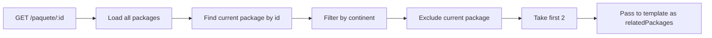

# Focused Implementation Plan: `/paquete` Page Improvements

## Scope

Only the following improvements will be implemented:

1. Fix feather icons CDN → local, replace emoji with feather icons
2. Add breadcrumb navigation
3. Enhance CTA visual hierarchy
4. Align card styling with design system
5. Clear visual hierarchy: continent badge → title → description → details → CTAs
6. Enhanced WhatsApp CTA with dual-line messaging
7. Related packages section (2 packages, filtered by continent)

---

## Implementation Steps

### Step 1: Update Route (`src/routes/paquete.js`)

Add related packages logic filtered by continent:

```javascript
// Find related packages by continent (max 2, excluding current)
const relatedPackages = packages
  .filter(pkg => 
    pkg.continent === paquete.continent && 
    pkg.id !== paquete.id && 
    pkg.visible
  )
  .slice(0, 2);

res.render('paquete', {
  paquete: paquete,
  relatedPackages: relatedPackages,
  currentPage: null
});
```

### Step 2: Update Template (`views/paquete.ejs`)

#### 2.1 Fix feather icons (CDN → local)

```html
<!-- Current -->
<script src="https://unpkg.com/feather-icons"></script>

<!-- Proposed -->
<script src="/js/feather.min.js" defer></script>
```

#### 2.2 Add breadcrumb navigation

```html
<nav aria-label="Breadcrumb" class="mb-6">
  <ol class="flex items-center gap-2 text-sm text-gray-400">
    <li><a href="/" class="hover:text-accent transition">Inicio</a></li>
    <li><span class="text-gray-600">/</span></li>
    <li><a href="/#packages-grid" class="hover:text-accent transition">Paquetes</a></li>
    <li><span class="text-gray-600">/</span></li>
    <li class="text-light" aria-current="page"><%= paquete.eventName %></li>
  </ol>
</nav>
```

#### 2.3 Align card styling with design system

```html
<!-- Current -->
<div class="bg-white p-6 sm:p-10 rounded-2xl shadow-lg border border-gray-100">

<!-- Proposed -->
<div class="card p-6 sm:p-10">
```

#### 2.4 Clear visual hierarchy

Structure:
```
[Continent Badge] → [Title (gold)] → [Description] → [Details with feather icons] → [CTAs]
```

#### 2.5 Replace emoji with feather icons

```html
<!-- Current -->
<li><strong>📅 Fechas:</strong> <%= paquete.availabilityDates %></li>
<p class="text-2xl text-accent font-bold mt-6">💵 <%= paquete.ticketPrice %></p>

<!-- Proposed -->
<li class="flex items-center gap-2 text-gray-700">
  <i data-feather="calendar" class="w-4 h-4 text-accent"></i>
  <strong>Fechas:</strong>
  <span><%= paquete.availabilityDates %></span>
</li>
<p class="text-2xl text-accent font-bold mt-6 flex items-center gap-2">
  <i data-feather="ticket" class="w-5 h-5"></i>
  U$S <%= paquete.ticketPrice ? paquete.ticketPrice.toLocaleString('es-ES') : 'Consultar' %>
</p>
```

#### 2.6 Enhanced WhatsApp CTA with dual-line messaging

```html
<!-- Current -->
<a href="<%= whatsappUrl %>" class="btn-accent inline-flex items-center gap-3 mt-6">
  <i data-feather="message-circle" class="w-5 h-5 text-light"></i>
  Contáctanos por WhatsApp
</a>

<!-- Proposed -->
<a href="<%= whatsappUrl %>" target="_blank" rel="noopener noreferrer"
   class="btn-accent inline-flex items-center gap-3 mt-8 px-8 py-4 text-lg shadow-lg hover:shadow-xl transition">
  <i data-feather="message-circle" class="w-6 h-6"></i>
  <div class="text-left">
    <span class="block text-xs font-normal opacity-80">¿Tenés dudas?</span>
    <span class="font-bold">Contáctanos por WhatsApp</span>
  </div>
</a>
```

#### 2.7 Related packages section

```html
<% if (relatedPackages && relatedPackages.length) { %>
<section class="mt-16">
  <div class="text-center mb-8">
    <h2 class="text-2xl sm:text-3xl font-bold">También te puede interesar</h2>
    <div class="divider mx-auto"></div>
  </div>
  <div class="grid grid-cols-1 sm:grid-cols-2 gap-8 max-w-3xl mx-auto">
    <% relatedPackages.forEach(pkg => { %>
      <li class="card">
        <div class="overflow-hidden rounded-xl mb-4">
          "
               alt="<%= pkg.eventName %>" 
               class="w-full h-40 object-cover rounded-xl transition-transform duration-300 hover:scale-105" 
               loading="lazy" />
        </div>
        <h3 class="text-lg font-bold tracking-tight mb-2 font-serif text-brand">
          <a href="/paquete/<%= pkg.id %>" class="hover:text-accent transition-colors">
            <%= pkg.eventName %>
          </a>
        </h3>
        <p class="text-sm mb-1 text-brand flex items-center gap-1">
          <i data-feather="calendar" class="w-4 h-4"></i>
          <strong>Fechas:</strong>
          <%= pkg.availabilityDates %>
        </p>
        <p class="text-lg font-bold text-accent mt-2 flex items-center gap-1">
          <i data-feather="ticket" class="w-4 h-4"></i>
          <% if (pkg.ticketPrice) { %>
            U$S <%= pkg.ticketPrice.toLocaleString('es-ES') %>
          <% } else { %>
            Consultar
          <% } %>
        </p>
        <a href="/paquete/<%= pkg.id %>" class="btn-brand mt-4 inline-block text-sm">
          Ver detalles
        </a>
      </li>
    <% }) %>
  </div>
</section>
<% } %>
```

---

## Files to Modify

| File | Changes |
|------|---------|
| `src/routes/paquete.js` | Add related packages logic |
| `views/paquete.ejs` | All template updates |

---

## Mermaid: Data Flow for Related Packages


