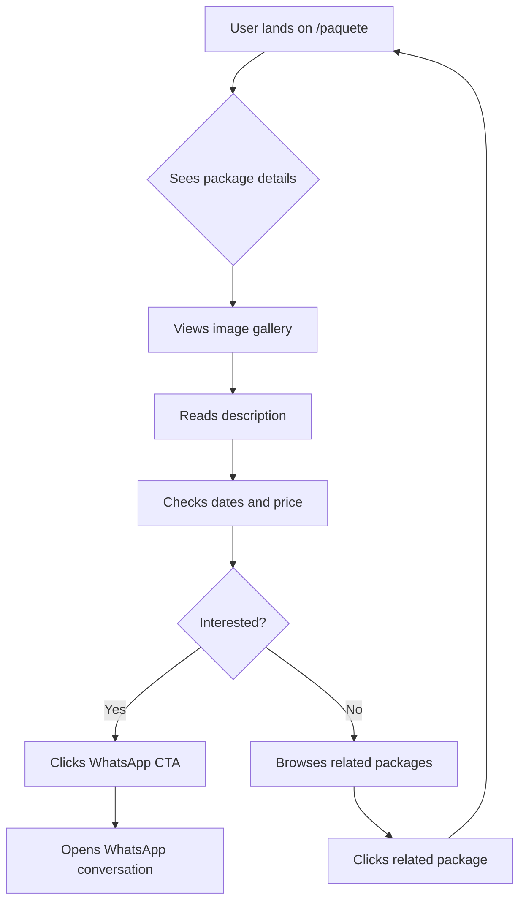

# UX/UI Improvements Proposal: `/paquete` Page

## Executive Summary

The `/paquete` (package detail) page serves as the conversion-critical landing for individual travel packages. Currently, it has significant UX/UI issues that reduce trust, engagement, and conversion potential. This document proposes improvements based on the established design system from [`index.ejs`](views/index.ejs:1) and [`theme.css`](public/styles/theme.css:1).

---

## Current State Analysis

### Page Structure (Current)

```
┌─────────────────────────────────────────────────────┐
│                    Header (fixed)                    │
├─────────────────────────────────────────────────────┤
│                                                     │
│  ┌───────────────────────────────────────────────┐  │
│  │  White card container (bg-white)              │  │
│  │  ┌─────────────────┬─────────────────────────┐ │
│  │  │                 │  GOLD title (accent)    │ │
│  │  │   Image         │  Description            │ │
│  │  │   (h-64)        │  Dates (emoji icon)     │ │
│  │  │                 │  Price (emoji icon)     │ │
│  │  │  [Continent     │  WhatsApp Button        │ │
│  │  │   badge]        │  Email fallback         │ │
│  │  └─────────────────┴─────────────────────────┘ │
│  └───────────────────────────────────────────────┘  │
│                                                     │
├─────────────────────────────────────────────────────┤
│                    Footer                            │
└─────────────────────────────────────────────────────┘
```

### Issues Identified

| # | Issue | Severity | Description |
|---|-------|----------|-------------|
| 1 | **Design System Inconsistency** | High | Uses `bg-white` card on navy background, but index uses navy canvas with white cards (`.card` class). The paquete page wraps everything in a single white container, breaking the established pattern. |
| 2 | **External CDN Dependency** | Medium | Uses `https://unpkg.com/feather-icons` instead of local `/js/feather.min.js` like index. This creates a potential point of failure and inconsistency. |
| 3 | **Missing Lightbox** | Medium | Image is static with no zoom/lightbox capability, unlike index which has a fullscreen lightbox. |
| 4 | **Poor Visual Hierarchy** | High | Title uses gold (`text-accent`) which is good, but the overall layout lacks clear information hierarchy. Description, dates, and price are presented without visual distinction. |
| 5 | **Emoji Icons** | Low | Uses emoji icons (📅, 💵) instead of consistent feather icons used throughout the rest of the site. |
| 6 | **No Related Packages** | Medium | No cross-selling or "you might also like" section to encourage exploration. |
| 7 | **Missing Breadcrumb** | Medium | No navigation breadcrumb to help users understand their location. |
| 8 | **No Gallery/Multiple Images** | Medium | Only shows a single image; travel packages benefit from multiple photos. |
| 9 | **CTA Placement** | Low | WhatsApp button is present but could be more prominent with better visual treatment. |
| 10 | **No Social Proof** | Medium | Missing testimonials, ratings, or trust indicators. |

---

## Proposed Improvements

### 1. Design System Alignment

**Problem:** The page uses a single white card (`bg-white`) that breaks from the navy canvas pattern.

**Solution:** Adopt the navy background with white card pattern consistent with [`index.ejs`](views/index.ejs:82):

```html
<!-- Current (inconsistent) -->
<section class="px-4 py-16 max-w-5xl mx-auto">
  <div class="bg-white p-6 sm:p-10 rounded-2xl shadow-lg border border-gray-100">

<!-- Proposed (consistent) -->
<section class="px-4 md:px-[10%] py-12">
  <div class="max-w-5xl mx-auto">
    <!-- Content uses .card class or navy-native elements -->
```

### 2. Enhanced Visual Hierarchy

**Proposed Layout:**

```
┌─────────────────────────────────────────────────────────────┐
│  [Breadcrumb: Home > Paquetes > Package Name]               │
├─────────────────────────────────────────────────────────────┤
│                                                             │
│  ┌─────────────────────────────────────────────────────┐   │
│  │              IMAGE GALLERY / SLIDER                  │   │
│  │         (multiple images with lightbox)              │   │
│  │  [◀]  [Image 1] [Image 2] [Image 3]  [▶]           │   │
│  └─────────────────────────────────────────────────────┘   │
│                                                             │
│  ┌─────────────────────────┬───────────────────────────┐   │
│  │                         │                           │   │
│  │  CONTINENT BADGE        │  PACKAGE TITLE (gold)     │   │
│  │                         │                           │   │
│  │  Description text...    │  📅 Dates                 │   │
│  │  More details...        │  💰 Price                 │   │
│  │                         │                           │   │
│  │                         │  [WhatsApp CTA - Primary] │   │
│  │                         │  [Email CTA - Secondary]  │   │
│  │                         │                           │   │
│  └─────────────────────────┴───────────────────────────┘   │
│                                                             │
├─────────────────────────────────────────────────────────────┤
│  RELATED PACKAGES (optional)                                │
│  [Card 1] [Card 2] [Card 3]                                 │
└─────────────────────────────────────────────────────────────┘
```

### 3. Breadcrumb Navigation

Add breadcrumb for context and navigation:

```html
<nav aria-label="Breadcrumb" class="mb-6">
  <ol class="flex items-center gap-2 text-sm text-gray-400">
    <li><a href="/" class="hover:text-accent transition">Inicio</a></li>
    <li><span class="text-gray-600">/</span></li>
    <li><a href="/#packages-grid" class="hover:text-accent transition">Paquetes</a></li>
    <li><span class="text-gray-600">/</span></li>
    <li class="text-light" aria-current="page"><%= paquete.eventName %></li>
  </ol>
</nav>
```

### 4. Image Gallery with Lightbox

Replace single image with a gallery that supports multiple images and lightbox:

```html
<!-- Image Gallery -->
<div class="relative mb-8">
  <div id="paqueteGallery" class="rounded-2xl overflow-hidden shadow-xl">
    <div class="flex transition-transform duration-700" id="galleryInner">
      <% if (paquete.images && paquete.images.length) { %>
        <% paquete.images.forEach((img, idx) => { %>
          <div class="min-w-full relative cursor-pointer" onclick="openLightbox('<%= img %>')">
            " alt="<%= paquete.eventName %>" 
                 class="w-full h-[300px] md:h-[450px] object-cover" />
            <div class="absolute inset-0 bg-black/20 pointer-events-none"></div>
          </div>
        <% }) %>
      <% } else { %>
        <div class="min-w-full relative cursor-pointer" onclick="openLightbox('<%= defaultImage %>')">
          " alt="<%= paquete.eventName %>" 
               class="w-full h-[300px] md:h-[450px] object-cover" />
        </div>
      <% } %>
    </div>
  </div>
  <!-- Gallery Navigation -->
  <button id="galleryPrev" class="absolute top-1/2 left-4 -translate-y-1/2 ...">◀</button>
  <button id="galleryNext" class="absolute top-1/2 right-4 -translate-y-1/2 ...">▶</button>
  <!-- Thumbnails -->
  <div class="flex gap-2 mt-4 justify-center">
    <% if (paquete.images && paquete.images.length) { %>
      <% paquete.images.forEach((img, idx) => { %>
        <button onclick="goToSlide(<%= idx %>)" class="gallery-thumb">
          " class="w-16 h-12 object-cover rounded" />
        </button>
      <% }) %>
    <% } %>
  </div>
</div>
```

### 5. Consistent Icon System

Replace emoji icons with feather icons:

```html
<!-- Current -->
<li><strong>📅 Fechas:</strong> <%= paquete.availabilityDates %></li>
<p class="text-2xl text-accent font-bold mt-6">💵 <%= paquete.ticketPrice %></p>

<!-- Proposed -->
<li class="flex items-center gap-2">
  <i data-feather="calendar" class="w-4 h-4 text-accent"></i>
  <strong>Fechas:</strong>
  <span><%= paquete.availabilityDates %></span>
</li>
<p class="text-2xl text-accent font-bold mt-6 flex items-center gap-2">
  <i data-feather="ticket" class="w-5 h-5"></i>
  U$S <%= paquete.ticketPrice ? paquete.ticketPrice.toLocaleString('es-ES') : 'Consultar' %>
</p>
```

### 6. Enhanced CTA Section

Improve the WhatsApp and email CTAs with better visual hierarchy:

```html
<!-- Primary CTA: WhatsApp -->
<a href="<%= whatsappUrl %>" target="_blank" rel="noopener noreferrer"
   class="btn-accent inline-flex items-center gap-3 text-lg px-8 py-4 shadow-lg hover:shadow-xl transition">
  <i data-feather="message-circle" class="w-6 h-6"></i>
  <div class="text-left">
    <span class="block text-sm font-normal opacity-80">¿Tenés dudas?</span>
    <span class="font-bold">Contáctanos por WhatsApp</span>
  </div>
</a>

<!-- Secondary CTA: Email -->
<a href="<%= emailUrl %>" class="inline-flex items-center gap-2 mt-4 text-gray-400 hover:text-accent transition">
  <i data-feather="mail" class="w-4 h-4"></i>
  <span>¿No tenés WhatsApp? Envianos un email</span>
</a>
```

### 7. Related Packages Section

Add cross-selling section at the bottom:

```html
<!-- Related Packages -->
<section class="mt-16">
  <div class="text-center mb-8">
    <h2 class="text-2xl sm:text-3xl font-bold">También te puede interesar</h2>
    <div class="divider mx-auto"></div>
  </div>
  <div class="grid grid-cols-1 sm:grid-cols-3 gap-6">
    <% if (relatedPackages && relatedPackages.length) { %>
      <% relatedPackages.slice(0, 3).forEach(pkg => { %>
        <li class="card">
          <!-- Same card structure as index -->
        </li>
      <% }) %>
    <% } %>
  </div>
</section>
```

### 8. Trust Indicators (Optional Enhancement)

Add social proof elements:

```html
<!-- Trust Badges -->
<div class="flex flex-wrap gap-4 justify-center mt-8 py-6 border-t border-gray-700">
  <div class="flex items-center gap-2 text-gray-400">
    <i data-feather="shield" class="w-5 h-5 text-accent"></i>
    <span class="text-sm">Reserva segura</span>
  </div>
  <div class="flex items-center gap-2 text-gray-400">
    <i data-feather="clock" class="w-5 h-5 text-accent"></i>
    <span class="text-sm">Respuesta en 24hs</span>
  </div>
  <div class="flex items-center gap-2 text-gray-400">
    <i data-feather="heart" class="w-5 h-5 text-accent"></i>
    <span class="text-sm">+500 viajeros felices</span>
  </div>
</div>
```

---

## Design System Consistency Checklist

| Element | Index Page | Paquete Page (Current) | Paquete Page (Proposed) |
|---------|------------|------------------------|-------------------------|
| Background | Navy (`bg-brand`) | Navy (`bg-brand`) | Navy (`bg-brand`) |
| Card Style | `.card` class (white) | `bg-white` inline | `.card` class (white) |
| Feather Icons | Local (`/js/feather.min.js`) | CDN (`unpkg.com`) | Local (`/js/feather.min.js`) |
| Icon Style | Feather icons | Emoji icons | Feather icons |
| Section Spacing | `mb-16`, `py-8` | `py-16` | `mb-16`, `py-8` |
| Divider | `.divider` class | None | `.divider` class |
| CTA Button | `.btn-accent` | `.btn-accent` | `.btn-accent` (enhanced) |
| Lightbox | Present | Missing | Present |
| Breadcrumb | N/A | Missing | Added |
| Related Content | Grid section | Missing | Grid section |

---

## Mermaid Diagram: User Flow



---

## Implementation Priority

| Priority | Task | Effort | Impact |
|----------|------|--------|--------|
| P0 | Fix feather icons CDN → local | Low | High |
| P0 | Replace emoji with feather icons | Low | Medium |
| P1 | Add breadcrumb navigation | Low | Medium |
| P1 | Enhance CTA visual hierarchy | Low | High |
| P2 | Add image gallery with lightbox | Medium | High |
| P2 | Add related packages section | Medium | High |
| P3 | Add trust indicators | Low | Medium |
| P3 | Design system alignment (card styling) | Medium | Medium |

---

## Files to Modify

1. [`views/paquete.ejs`](views/paquete.ejs:1) - Main template updates
2. [`public/js/main.js`](public/js/main.js:1) - Gallery/lightbox functionality
3. [`src/routes/paquete.js`](src/routes/paquete.js:1) - Add related packages data
4. [`public/styles/theme.css`](public/styles/theme.css:1) - Any new styles needed

---

## Next Steps

1. Review and approve this proposal
2. Switch to Code mode for implementation
3. Implement changes in priority order
4. Test on mobile and desktop viewports
5. Verify all links and CTAs work correctly
